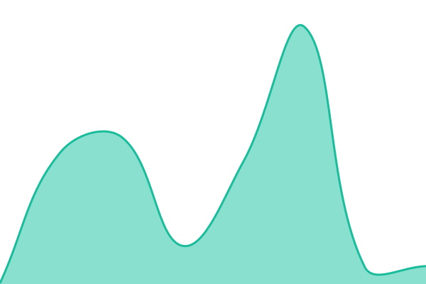
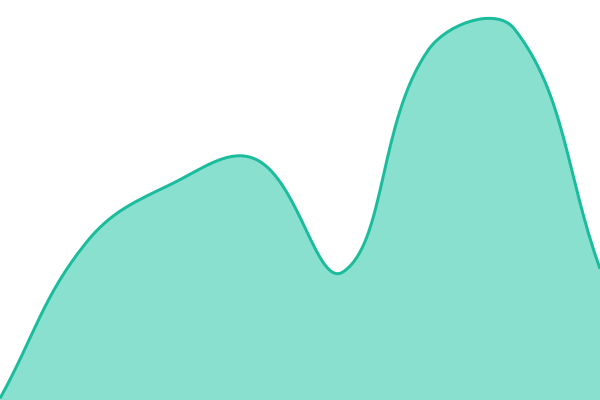
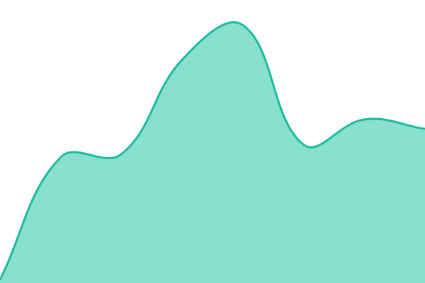
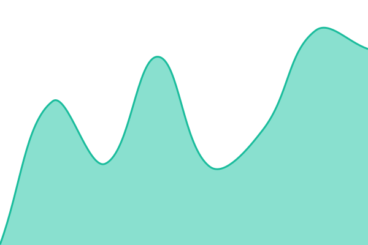
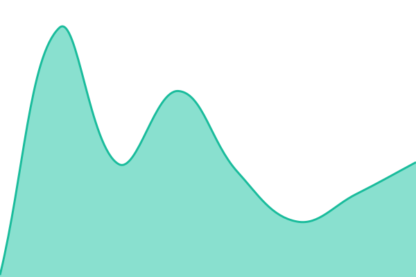

# [📈 Live Status](https://your-github-username.github.io/kova-status): <!--live status--> **🟧 Partial outage**

This repository contains the open-source uptime monitor and status page for [your-github-username](https://your-github-username.github.io/kova-status), powered by [Upptime](https://github.com/upptime/upptime).

With [Upptime](https://upptime.js.org), you can get your own unlimited and free uptime monitor and status page, powered entirely by a GitHub repository. We use [Issues](https://github.com/your-github-username/kova-status/issues) as incident reports, [Actions](https://github.com/your-github-username/kova-status/actions) as uptime monitors, and [Pages](https://your-github-username.github.io/kova-status) for the status page.

<!--start: status pages-->
<!-- This summary is generated by Upptime (https://github.com/upptime/upptime) -->
<!-- Do not edit this manually, your changes will be overwritten -->
<!-- prettier-ignore -->
| URL | Status | History | Response Time | Uptime |
| --- | ------ | ------- | ------------- | ------ |
|  [Video Calls](https://api.agora.io) | 🟥 Down | [video-calls.yml](https://github.com/phillip-kova/kova-status/commits/HEAD/history/video-calls.yml) | 

 140ms
     
 | 

<a href="https://phillip-kova.github.io/kova-status/history/video-calls">100.00%</a>
    

|  [Matching & Pulses](https://diapbnvhkwcdhtrhpfbj.supabase.co/rest/v1/) | 🟩 Up | [matching-and-pulses.yml](https://github.com/phillip-kova/kova-status/commits/HEAD/history/matching-and-pulses.yml) | 

 104ms
     
 | 

<a href="https://phillip-kova.github.io/kova-status/history/matching-and-pulses">100.00%</a>
    

|  [Sign Up & Verification](https://diapbnvhkwcdhtrhpfbj.supabase.co/auth/v1/health) | 🟥 Down | [sign-up-and-verification.yml](https://github.com/phillip-kova/kova-status/commits/HEAD/history/sign-up-and-verification.yml) | 

 92ms
     
 | 

<a href="https://phillip-kova.github.io/kova-status/history/sign-up-and-verification">100.00%</a>
    

|  [Payments](https://status.revenuecat.com) | 🟩 Up | [payments.yml](https://github.com/phillip-kova/kova-status/commits/HEAD/history/payments.yml) | 

 281ms
     
 | 

<a href="https://phillip-kova.github.io/kova-status/history/payments">100.00%</a>
    

|  [Messaging](https://diapbnvhkwcdhtrhpfbj.supabase.co/realtime/v1/) | 🟩 Up | [messaging.yml](https://github.com/phillip-kova/kova-status/commits/HEAD/history/messaging.yml) | 

 49ms
     
 | 

<a href="https://phillip-kova.github.io/kova-status/history/messaging">100.00%</a>
    

<!--end: status pages-->

[**Visit our status website →**](https://your-github-username.github.io/kova-status)

## 📄 License

- Powered by: [Upptime](https://github.com/upptime/upptime)
- Code: [MIT](./LICENSE) © [Anand Chowdhary](https://anandchowdhary.com)
- Data in the `./history` directory: [Open Database License](https://opendatacommons.org/licenses/odbl/1-0/)
